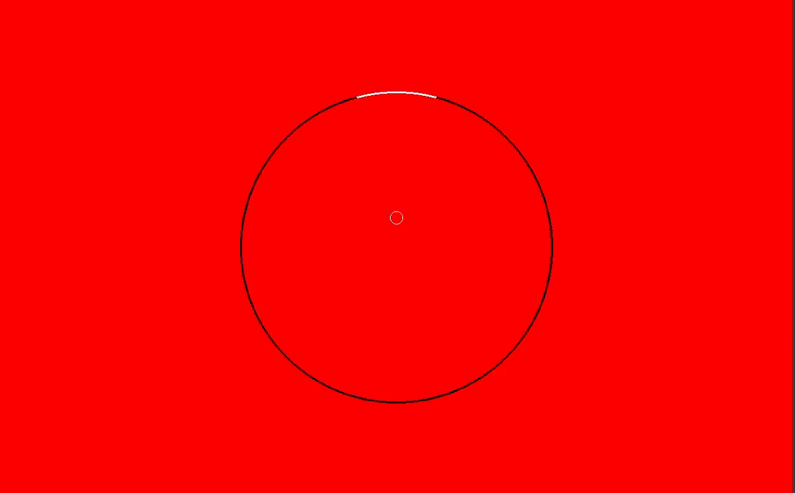

# x86 Assembly Monopong (linux)
The goal was to make something complete from scratch using no libraries, so I decided to make a variation of the classic game 'pong'. 

### Running the game
1. First adjust the screen and keyboard device variables in config.asm, which contains instructions for obtaining the correct values.
2. Then change to a tty without a gui, for me tty3 was good on ubuntu. This is because I write directly to the framebuffer, which is hogged by which ever windowing system your OS is using (e.g X11) on the main tty.
3. Run `bash run.sh`. 

### Preview

### Algorithms
1. Taylor series was used to implement trig functions like sine. I tried other techniques like lookup tables, bashkara's approximation and the cordic method but I already understand taylor series well from previous maths courses so just went with that.
2. Newton raphson for square root.
3. Bresenham's circle algorithm for rendering the circle efficiently.
4. Collision mechanics for bouncing etc.
